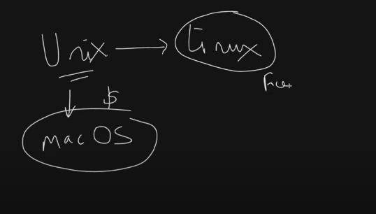

Absolutely! Let's start learning Linux step-by-step in Roman Urdu. Here's an overview of what we'll cover:

1. **Introduction to Linux**
2. **Basic Commands**
3. **File Management**
4. **User Management**
5. **Permissions**
6. **Networking**
7. **Package Management**
8. **Shell Scripting**
9. **System Monitoring and Maintenance**

### 1. Introduction to Linux

**Linux kya hai?**
Linux aik operating system hai jo UNIX par based hai. Yeh open-source aur free hai. Is mein bohat saari distributions hain jese ke Ubuntu, CentOS, Debian, etc.

**Linux ka structure:**
- **Kernel:** Yeh operating system ka core hai.
- **Shell:** Yeh interface hai jo user aur kernel ke darmiyan hota hai.
- **File System:** Yeh structure hai jis mein files aur directories organized hoti hain.

### 2. Basic Commands

**Command Line Interface (CLI):**
- **Terminal:** Aik application jo command line ke sath interact karti hai.
- **Shell:** Aik program jo commands ko execute karta hai.

**Basic Commands:**
- `pwd` - Present Working Directory: Abhi aap kis directory mein hain.
- `ls` - List: Current directory mein files aur directories list karne ke liye.
- `cd` - Change Directory: Directory change karne ke liye.
- `mkdir` - Make Directory: Nai directory banane ke liye.
- `rmdir` - Remove Directory: Empty directory ko delete karne ke liye.
- `touch` - Nai file banane ke liye.
- `rm` - File ko delete karne ke liye.
- `cp` - File copy karne ke liye.
- `mv` - File move ya rename karne ke liye.

### Example Commands

**Present Working Directory:**
```bash
pwd
```

**List Files and Directories:**
```bash
ls
```

**Change Directory:**
```bash
cd /path/to/directory
```

**Make Directory:**
```bash
mkdir new_directory
```

**Remove Directory:**
```bash
rmdir old_directory
```

**Create New File:**
```bash
touch newfile.txt
```

**Remove File:**
```bash
rm file.txt
```

**Copy File:**
```bash
cp source.txt destination.txt
```

**Move or Rename File:**
```bash
mv oldname.txt newname.txt
```

### 3. File Management

**Files aur directories ko manage karna:**

**File ko read karna:**
```bash
cat file.txt
```

**File ko edit karna (nano editor use karte hue):**
```bash
nano file.txt
```

**Directory ka content dekhna (detailed):**
```bash
ls -l
```

**Hidden files dekhna:**
```bash
ls -a
```

**Path ke baare mein detail information:**
```bash
ls -la /path/to/directory
```

### 4. User Management

**Users aur groups ko manage karna:**

**New user create karna:**
```bash
sudo adduser newuser
```

**User ko delete karna:**
```bash
sudo deluser olduser
```

**User ka password change karna:**
```bash
passwd username
```

**Current user ke information dekhna:**
```bash
whoami
```

### 5. Permissions

**Files aur directories ke permissions manage karna:**

**Permissions check karna:**
```bash
ls -l
```

**Permissions change karna:**
```bash
chmod 755 file.txt
```

**Ownership change karna:**
```bash
chown user:group file.txt
```

### 6. Networking

**Networking commands aur configurations:**

**IP address check karna:**
```bash
ifconfig
```

**Network connections check karna:**
```bash
netstat
```

**Ping command use karna:**
```bash
ping google.com
```

### 7. Package Management

**Software packages install aur manage karna:**

**Package install karna (Ubuntu/Debian):**
```bash
sudo apt-get install package_name
```

**Package remove karna:**
```bash
sudo apt-get remove package_name
```

**System update karna:**
```bash
sudo apt-get update
```

### 8. Shell Scripting

**Scripts likhna aur execute karna:**

**Simple script likhna:**
```bash
nano script.sh
```

**Script execute karna:**
```bash
bash script.sh
```

### 9. System Monitoring and Maintenance

**System ko monitor aur maintain karna:**

**System information check karna:**
```bash
top
```

**Disk space check karna:**
```bash
df -h
```

**Memory usage check karna:**
```bash
free -m
```

**Log files dekhna:**
```bash
tail -f /var/log/syslog
```

Agar aapko kisi specific topic par detail chahiye ho, to zarur batayein.